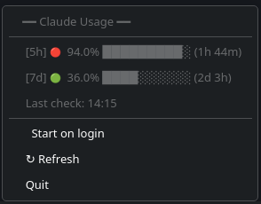
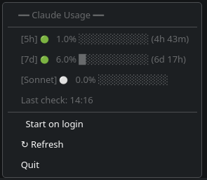

# Claude Usage Tracker

A lightweight **cross-platform** system tray application for monitoring your Claude Code API usage in real-time. Available for **Linux**, **macOS**, and **Windows**.

## Features

- **System tray indicator** - Color-coded icon shows usage status at a glance
  - Green: Normal usage (< 75%)
  - Yellow: Warning (>= 75% and < 90%)
  - Red: Critical (>= 90%)
- **Detailed menu** - Shows 5-hour, 7-day, Opus, and Sonnet usage with reset times
- **Notifications** - Alerts at 75% and 90% thresholds
- **Auto-refresh** - Polls API every 2 minutes (with jitter)
- **Manual refresh** - Click "↻ Refresh" anytime
- **Autostart** - Optionally launch on system boot
- **Cross-platform** - Native builds for Linux, macOS, and Windows

## Screenshots

| High Usage | Low Usage |
|------------|-----------|
|  |  |

The tray menu displays usage for each time window with visual progress bars, color-coded status indicators, and time until reset.

## Prerequisites

- **Claude Code** authenticated: `claude auth login`

### Building from source

- **Rust** 1.77.2+ with Cargo
- **Tauri CLI**: `cargo install tauri-cli`
- **Platform-specific dependencies**: See platform sections below

## Installation

Download the latest release for your platform from the [Releases page](https://github.com/user/claude-usage-tracker/releases).

---

### Linux

#### Debian/Ubuntu (.deb)

```bash
# Install the package
sudo dpkg -i claude-usage-tracker_0.1.0_amd64.deb

# If dependencies are missing, fix them with:
sudo apt-get install -f
```

The package includes all required dependencies and installs:
- Application binary to `/usr/bin/`
- Desktop entry and icon
- XDG autostart entry (disabled by default)

#### Universal Linux (.AppImage)

The `.AppImage` is a portable package that works on most Linux distributions:

```bash
# Make executable
chmod +x Claude-Usage-Tracker_0.1.0_amd64.AppImage

# Run directly
./Claude-Usage-Tracker_0.1.0_amd64.AppImage
```

#### Build dependencies (Linux)

```bash
# Ubuntu/Debian
sudo apt install libwebkit2gtk-4.1-dev libayatana-appindicator3-dev

# Fedora
sudo dnf install webkit2gtk4.1-devel libappindicator-gtk3-devel

# Arch
sudo pacman -S webkit2gtk-4.1 libayatana-appindicator
```

---

### macOS

#### DMG installer

1. Download `Claude-Usage-Tracker_0.1.0_universal.dmg`
2. Open the DMG file
3. Drag the app to your Applications folder
4. Launch from Applications or Spotlight

The universal binary runs natively on both **Intel** and **Apple Silicon** Macs.

#### Homebrew (coming soon)

```bash
# Not yet available
brew install --cask claude-usage-tracker
```

---

### Windows

#### MSI installer (recommended)

1. Download `Claude-Usage-Tracker_0.1.0_x64_en-US.msi`
2. Run the installer
3. Follow the installation wizard
4. Launch from Start Menu

#### Portable executable

1. Download `Claude-Usage-Tracker_0.1.0_x64-setup.exe`
2. Run the setup executable
3. Follow the prompts

---

### From source (all platforms)

```bash
# Clone and build
git clone <repository-url>
cd claude-usage
cargo tauri build

# Binary will be in target/release/bundle/
```

### Development

```bash
cargo tauri dev
```

## Auto-start

The application can automatically start when you log into your system.

**Enabling/disabling:**
- Click the tray icon menu
- Select "Start on login" (shows checkmark when enabled)

### Platform-specific details

#### Linux
Uses the XDG Autostart standard. Entry created at:
```
~/.config/autostart/com.claude-usage-tracker.desktop
```

#### macOS
Uses Launch Services. Entry managed via System Preferences > Users & Groups > Login Items.

#### Windows
Uses the Windows Registry (HKCU\Software\Microsoft\Windows\CurrentVersion\Run).

## Usage

1. Ensure you're authenticated with Claude Code:
   ```bash
   claude auth login
   ```

2. Launch the app - it will appear in your system tray

3. Click the tray icon to see:
   - 5-hour usage and reset time
   - 7-day usage and reset time
   - Last update timestamp
   - Refresh and Quit options

## Configuration

The app uses credentials from `~/.claude/.credentials.json` (created by `claude auth login`).

### Config file location

| Platform | Path |
|----------|------|
| Linux | `~/.config/claude-usage-tracker/config.toml` |
| macOS | `~/Library/Application Support/com.claude-usage-tracker/config.toml` |
| Windows | `%APPDATA%\com.claude-usage-tracker\config.toml` |

If the config file doesn't exist, the app creates one with sensible defaults on first run.

### Example Configuration

```toml
# Thresholds (apply uniformly to all usage windows)
warning-threshold = 75.0      # Warning notification threshold (%)
critical-threshold = 90.0     # Critical notification threshold (%)
reset-threshold = 50.0        # Reset notification state when below (%)

# Intervals
polling-interval-minutes = 2          # API poll interval (default: 2 min)
notification-cooldown-minutes = 5     # Minimum time between notifications
```

### Split Icon System

The tray icon shows both windows: left half = 5-hour, right half = 7-day.

- Green: Normal (< warning threshold)
- Yellow: Warning (>= warning and < critical)
- Red: Critical (>= critical threshold)

### Polling interval

Default: 2 minutes with fixed ±30-second jitter (minimum 60s between polls). Jitter is not configurable.

## Troubleshooting

### All platforms

#### "Credentials not found"
Run `claude auth login` to authenticate with Claude Code.

#### "Token expired"
Re-run `claude auth login` when prompted to refresh your credentials.

---

### Linux

#### Tray icon not visible
Ensure you have a system tray compatible with AppIndicator:
- **GNOME**: Install the [AppIndicator extension](https://extensions.gnome.org/extension/615/appindicator-support/)
- **KDE/XFCE**: Should work out of the box

#### Build fails
Install system dependencies (see [Build dependencies (Linux)](#build-dependencies-linux) above).

---

### macOS

#### App won't open ("unidentified developer")
Right-click the app and select "Open", then confirm in the dialog. This is only required once.

#### Tray icon not visible
The app appears in the menu bar (top-right of screen). If not visible, check System Preferences > Control Center > Menu Bar Only.

---

### Windows

#### SmartScreen warning
Click "More info" then "Run anyway". This occurs because the app is not code-signed.

#### Tray icon not visible
Check the system tray overflow area (click the ^ arrow in the taskbar). You can drag the icon to the visible area.

## Architecture

```
src/
├── main.rs         # App entry, thin wiring layer
├── lib.rs          # Module declarations, AppState, event handler loop
├── events.rs       # AppEvent, CredentialRefreshResult
├── service.rs      # Polling loop, notifications, credential refresh
├── auth.rs         # Credential loading from ~/.claude/
├── api.rs          # Claude API client with retry logic
├── tray.rs         # System tray UI, menu handling
└── config.rs       # Configuration loading and validation
icons/              # Tray icon variants (project root)
```

## License

MIT
